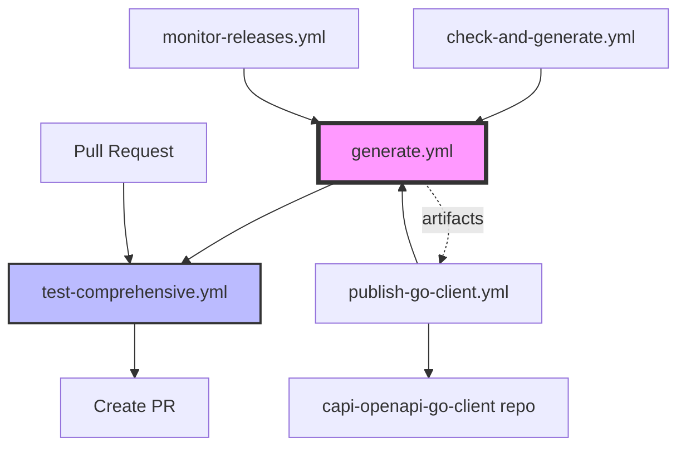

# GitHub Actions Workflows

This directory contains automated workflows for the CAPI OpenAPI specification project.

## Workflow Architecture

The workflows are organized into a clear hierarchy that mirrors the `make all` pipeline:

### Core Workflows

#### 1. Generate (`generate.yml`) - Complete Pipeline

**Purpose**: Primary workflow that mirrors the `make all` command, providing the complete generation pipeline.

**Triggers**:
- Manual dispatch with version input
- Called by other workflows (reusable)

**Pipeline Steps** (matches `make all`):
1. **Dependencies**: Install Perl, Node.js, Java, Go 1.24.4 tools
2. **Spec Generation**: 
   - Download HTML documentation (`make prepare`)
   - Generate OpenAPI specification (`make spec`)
3. **SDK Generation**: Generate Go SDK using oapi-codegen (`make sdk`)
4. **Documentation**: Generate API documentation with Redocly (`make docs`)
5. **Testing**: Validate spec, examples, and schemas (`make test`)

**Outputs**:
- OpenAPI specification (JSON/YAML)
- Go SDK
- API documentation
- Generation reports

**Usage**:
```bash
# Manual trigger via GitHub UI
# Go to Actions > Generate (Complete Pipeline) > Run workflow
# Enter version: 3.195.0
```

#### 2. Test Comprehensive (`test-comprehensive.yml`)

**Purpose**: Consolidated testing for specifications and SDKs.

**Triggers**:
- Pull requests (automatic)
- Manual dispatch
- Called by other workflows

**Test Suite**:
- OpenAPI specification validation (Spectral, Redocly)
- Example validation
- Schema testing
- Multi-language SDK generation testing (Go, Python, Java, TypeScript, Ruby)
- Integration tests

**Features**:
- Automatic PR comments with results
- Parallel testing across languages
- Artifact uploads for generated SDKs

### Automation Workflows

#### 3. Check and Generate (`check-and-generate.yml`)

**Purpose**: Daily automation to check for updates and generate new versions.

**Triggers**:
- Daily schedule (2 AM UTC)
- Manual dispatch with dry-run option

**Process**:
1. Check for new CAPI releases on GitHub
2. Generate specs and SDKs for new versions
3. Run comprehensive tests
4. Create pull requests automatically
5. Create/update tracking issue

**Features**:
- Dry-run mode for testing
- Automatic PR creation with full details
- Issue tracking for updates
- Batch processing of multiple versions

#### 4. Monitor Releases (`monitor-releases.yml`)

**Purpose**: Hourly monitoring with notifications.

**Triggers**:
- Hourly schedule
- Manual dispatch

**Features**:
- Creates GitHub issues for new releases
- Triggers generation workflow
- Sends Slack notifications (if configured)
- Maintains state to avoid duplicates

### Publishing Workflow

#### 5. Publish Go Client (`publish-go-client.yml`)

**Purpose**: Publish Go SDK to the separate capi-openapi-go-client repository.

**Triggers**:
- Manual dispatch with version and force options

**Process**:
1. Uses `generate.yml` workflow to create spec and SDK
2. Downloads generated artifacts
3. Clones target repository
4. Updates with new SDK code
5. Creates version tag and GitHub release
6. Uses Go 1.24.4 (latest stable)

**Target Repository**: [cloudfoundry-community/capi-openapi-go-client](https://github.com/cloudfoundry-community/capi-openapi-go-client)

### Deprecated Workflows

The following workflows are deprecated but kept for backwards compatibility:

- **`test-sdks.yml`**: Redirects to `test-comprehensive.yml`
- **`validate-pr.yml`**: Redirects to `test-comprehensive.yml`
- **`generate-spec.yml`**: Removed (replaced by `generate.yml`)
- **`check-updates.yml`**: Removed (replaced by `check-and-generate.yml`)

## Workflow Dependencies



## Configuration

### Required Secrets

- `GITHUB_TOKEN`: Automatically provided by GitHub Actions
- `CAPI_GO_CLIENT_DEPLOY_KEY`: SSH key for pushing to go client repo
- `SLACK_WEBHOOK`: (Optional) For Slack notifications

### Environment Variables

- `CAPI_VERSION`: Default version to process
- `PR_REVIEWERS`: Comma-separated list of reviewers for auto-created PRs

## Workflow Execution Flow

### Automated Daily Flow
1. `check-and-generate.yml` runs daily at 2 AM UTC
2. If new versions found:
   - Calls `generate.yml` for each version
   - Runs `test-comprehensive.yml`
   - Creates pull requests
   - Updates tracking issue

### Manual Publishing Flow
1. Merge PR with new CAPI version
2. Run `publish-go-client.yml` manually
3. Go client published to separate repository
4. GitHub release created automatically

### PR Validation Flow
1. Developer creates PR with changes
2. `test-comprehensive.yml` runs automatically
3. Results commented on PR
4. All tests must pass before merge

## Manual Intervention

### When Updates Are Detected
1. Review the automatically created PR
2. Check the test results in the PR
3. Review breaking changes if any
4. Merge the PR after validation
5. Run publish workflow if needed

### Failed Workflows
1. Check workflow logs for errors
2. Common issues:
   - Dependency installation failures
   - Network timeouts downloading specs
   - Validation errors in generated specs
   - SDK generation failures
3. Re-run failed jobs or trigger manually

## Local Testing

To test workflows locally, use [act](https://github.com/nektos/act):

```bash
# Test generation workflow
act workflow_dispatch -j generate -s GITHUB_TOKEN=$GITHUB_TOKEN

# Test PR validation
act pull_request -j test-comprehensive

# Test publishing (dry run)
act workflow_dispatch -j publish --dry-run
```

## Maintenance

### Updating Dependencies
- Go version: Update to latest stable in all workflows (currently 1.24.4)
- Perl version: Update in `shogo82148/actions-setup-perl@v1`
- Node.js version: Update in `actions/setup-node@v4`
- Java version: Update in `actions/setup-java@v4`

### Adding New Languages for SDK Testing
1. Add to matrix in `test-comprehensive.yml`
2. Add language-specific setup steps
3. Add compilation/test commands
4. Update this documentation

### Changing Schedules
Edit cron expressions in workflow files:
- Daily automation: `0 2 * * *` (2 AM UTC)
- Hourly monitoring: `0 * * * *` (every hour)

See [crontab.guru](https://crontab.guru/) for help with cron syntax.

## Best Practices

1. **Version Management**: Always specify explicit versions when triggering workflows
2. **Testing**: All PRs are automatically tested via `test-comprehensive.yml`
3. **Monitoring**: Two-tier monitoring (hourly + daily) ensures quick detection
4. **Dependencies**: Workflows use latest stable versions (Go 1.24.4)
5. **Artifacts**: All generated files preserved for 30 days
6. **Reusability**: Core workflows designed to be called by others
7. **Idempotency**: Workflows can be safely re-run without side effects