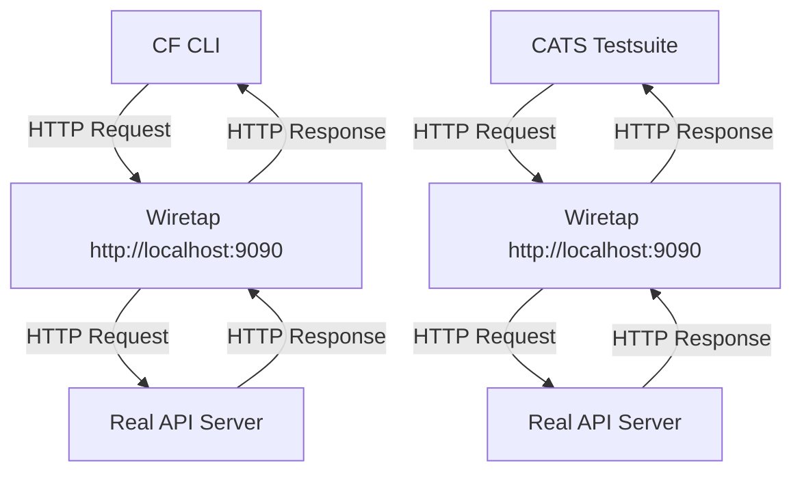

# Cloud Foundry CAPI OpenAPI Specification - Experimental

> **Note:** This repository is an experimental project to explore the OpenAPI specification for the Cloud Foundry API (CAPI). It is not an official Cloud Foundry project and may not be suitable for production use.

This repository contains the OpenAPI 3.0 specification for the Cloud Foundry API (CAPI). It provides a complete, machine-readable definition of the CAPI endpoints, enabling automated client generation, documentation, and testing.

## Project Structure

The repository is organized as follows:

- `apis/cf/`: Contains the OpenAPI specification files, versioned by CAPI release.
  - `latest/`: A symlink to the latest stable version.
  - `3.130.0/`: An example of a specific version folder.
- `bin/`: Houses build and utility scripts for managing the specification.
- `scripts/`: Additional scripts for development and maintenance tasks.

## Getting Started

### Prerequisites

- [Node.js](https://nodejs.org/)
- [Yarn](https://yarnpkg.com/)

### Installation

1. Clone the repository:

   ```bash
   git clone https://github.com/cloudfoundry-community/capi-openapi-spec.git
   cd capi-openapi-spec
   ```

2. Install the dependencies:

   ```bash
   yarn install
   ```

### Usage

**Linting**

`yarn lint`

Lints the OpenAPI specification files using [`redocly lint`](https://github.com/Redocly/redocly-cli) to ensure they adhere to the defined rules and best practices. This helps maintain consistency and quality in the specification.

**Building**

`yarn build`

Executes the `bin/build.js` script to bundle the modular OpenAPI files from `apis/cf/**/` into individual bundled `openapi.yaml` files in the `dist/` directory. It uses [`redocly`](https://github.com/Redocly/redocly-cli) to merge the different OpenAPI files into a single file for each version.

**Previewing**

`yarn preview`

First, this command runs the build script to ensure the latest specification is bundled. Then, it starts a local HTTP server using `http-server` to serve the `dist/` directory. This allows you to preview the generated documentation locally in your browser.

**Creating a new version**

`yarn create-version 3.131.0`

Runs the `bin/create-version.js` script, which is used to create a new versioned directory under `apis/cf/`. This is useful when a new version of the CAPI is released and you need to update the specification. It copies the current `apis/cf/latest/openapi.yaml` to a new versioned directory, and maintains the `redocly.yaml` file for the new version. After running this command and rebuilding, the new version will be available in scalar.

**Compliance Testing**

`yarn test:compliance https://api.example.com dist/latest/openapi.yaml`

Executes the `bin/test-compliance.js` script to run compliance tests against the OpenAPI specification. This ensures that the specification is valid and conforms to the OpenAPI standard. It uses [`wiretap`](https://github.com/pb33f/wiretap) that acts like a proxy server to intercept requests and validate them against the OpenAPI spec.



Hereby `Wiretap` acts as a proxy server that intercepts HTTP requests and responses between the CF CLI or CATS testsuite and the real API server. It validates the requests and responses against the OpenAPI specification, ensuring compliance.

**Mock Server**

`yarn test:mockserver`

Runs the `bin/test-mockserver.js` script to start a mock server based on the OpenAPI specification. This is useful for testing API clients and integrations without needing a live CAPI environment.

## Contributing

Contributions are welcome! Please feel free to submit a pull request or open an issue to discuss any changes.

## License

This project is licensed under the Apache-2.0 License. See the [LICENSE](LICENSE) file for details.
