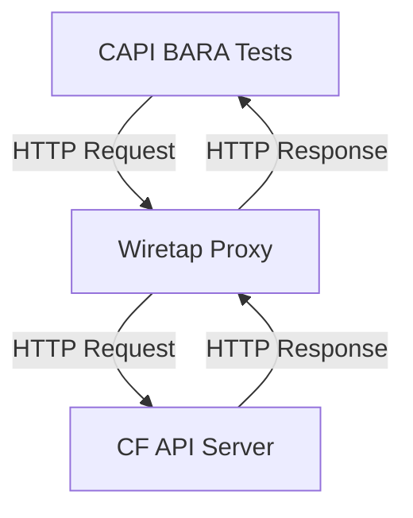

# Cloud Foundry CAPI OpenAPI Specification - Experimental

> **Note:** This repository is an experimental project to explore the OpenAPI specification for the Cloud Foundry API (CAPI). It is not an official Cloud Foundry project and may not be suitable for production use.

This repository contains the OpenAPI 3.0 specification for the Cloud Foundry API (CAPI). It provides a complete, machine-readable definition of the CAPI endpoints, enabling automated client generation, documentation, and testing.

A rendered version can be consumed at https://cloudfoundry.github.io/cf-openapi/ 

## Project Structure

The repository is organized as follows:

- `apis/cf/`: Contains the OpenAPI specification files, versioned by CAPI release.
  - `latest/`: A symlink to the latest stable version.
  - `3.130.0/`: An example of a specific version folder.
- `bin/`: Houses build and utility scripts for managing the specification.
- `scripts/`: Additional scripts for development and maintenance tasks.

## Getting Started

### Prerequisites

- [Node.js](https://nodejs.org/)
- [Yarn](https://yarnpkg.com/)

### Installation

1. Clone the repository:

   ```bash
   git clone https://github.com/cloudfoundry/cf-openapi.git
   cd cf-openapi
   ```

2. Install the dependencies:

   ```bash
   yarn install
   ```

### Usage

**Linting**

`yarn lint`

Lints the OpenAPI specification files using [`redocly lint`](https://github.com/Redocly/redocly-cli) to ensure they adhere to the defined rules and best practices. This helps maintain consistency and quality in the specification.

**Building**

`yarn build`

Executes the `bin/build.js` script to bundle the modular OpenAPI files from `apis/cf/**/` into individual bundled `openapi.yaml` files in the `dist/` directory. It uses [`redocly`](https://github.com/Redocly/redocly-cli) to merge the different OpenAPI files into a single file for each version.

**Previewing**

`yarn preview`

First, this command runs the build script to ensure the latest specification is bundled. Then, it starts a local HTTP server using `http-server` to serve the `dist/` directory. This allows you to preview the generated documentation locally in your browser.

**Creating a new version**

`yarn create-version 3.131.0`

Runs the `bin/create-version.js` script, which is used to create a new versioned directory under `apis/cf/`. This is useful when a new version of the CAPI is released and you need to update the specification. It copies the current `apis/cf/latest/openapi.yaml` to a new versioned directory, and maintains the `redocly.yaml` file for the new version. After running this command and rebuilding, the new version will be available in scalar.

**Compliance Testing**

`yarn test:compliance`

Runs a comprehensive compliance test suite against a live Cloud Foundry API. This script uses `wiretap` to proxy requests to the API, validating them against the OpenAPI specification in real-time. It clones the `capi-bara-tests` repository and executes its test suite against the proxied API.

> :warning: Unfortunally wiretap seems to be quite instable it cannot properly handle multiform-data requests and sometimes just crashes with memory erros. Its currently as good as it is and helped a lot making the spec compliant.

**Prerequisites:**

- Go must be installed and available in your `PATH`.
- The following environment variables must be set:
  - `CF_API_URL`: The URL of the Cloud Foundry API.
  - `CF_APPS_DOMAIN`: The application domain for your Cloud Foundry instance.
  - `CF_ADMIN_USER`: The username for an admin user.
  - `CF_ADMIN_PASSWORD`: The password for the admin user.

**Optional:**

- `THREADS`: The number of parallel test nodes to run (default: 6).

The script will generate a `wiretap-report.json` file in the `out` directory, which contains a detailed report of the API interactions and any compliance issues found.



**Contract Testing (Mock Server)**

`yarn test:mockserver <spec-file>`

Executes the `bin/test-mockserver.js` script to run contract tests against a running server (either a live API or a mock server). This script uses `wiretap` to validate that the server's responses conform to the OpenAPI specification.

**Example:**

```bash
yarn test:mockserver http://localhost:4010 dist/latest/openapi.yaml
```

This is useful for:

- Validating a mock server's implementation against the OpenAPI spec.
- Quickly checking a live API for compliance without running the full `capi-bara-tests` suite.

## Contributing

Contributions are welcome! Please feel free to submit a pull request or open an issue to discuss any changes.

## License

This project is licensed under the Apache-2.0 License. See the [LICENSE](LICENSE) file for details.
